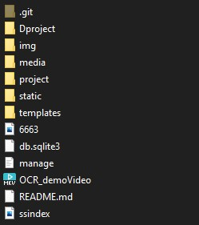
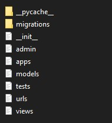
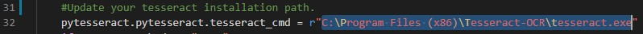

# Code Ed-Hackathon
Build an OCR-based engine that scans, converts image text into downloadable text using machine learning tech.

## Tech Used
<ul>
  <li>Python</li>
  <li>Djnago framework</li>
  <li>Python-tesseract (optical character recognition tool)</li>
</ul>

## How to install
<ul>
  <li>First, let’s download and install tesseract thorugh this <a href="http://digi.bib.uni-mannheim.de/tesseract/tesseract-ocr-setup-4.00.00dev.exe">link</a>.</li>
  <li>Update the tesseract installed path in application.
    <ul>
      <li>open "project" directory.  </li>
      <li>after that you will find a file named "view.py".  </li>
      <li>open it and on line 32 update the path where your tesseract is update on local PC </li>
      <li> Now you are good to go</li>
    </ul>
</ul>

## How to use
<ul>
  <li>Extract Malicious-Urlv5 zip file.</li>
  <li>Open command prompt in Malicious-Urlv5 folder</li>
  <li>To run the code, write following command in terminal.</li>
    <ul>
      <li>python manage.py runserver</li>
  </ul>
  <li>Type http://127.0.0.1:8000/ in URL bar of browser and press Enter. Machine Learning powered Web Application will start.</li>
  <li>Now you can upload text image or paste snippet on web appliaction to change it on text formate.</li>
  <li>Even you can also download all your previously changed text using downdload button web application</li>
</ul>
  
